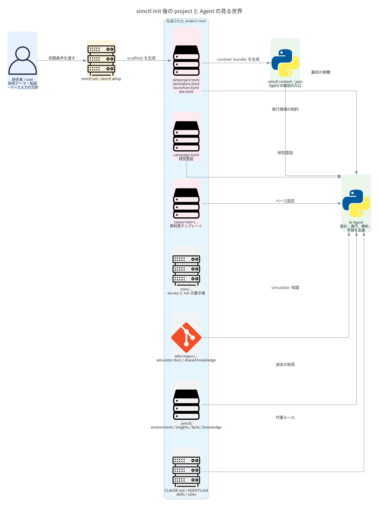
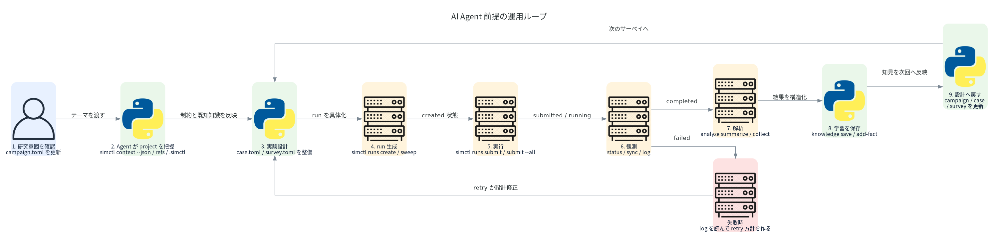
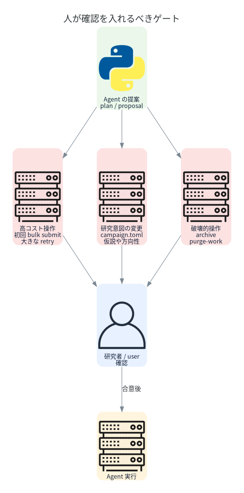

# AI Agent 前提の project 運用概念図

> このファイルは `python scripts/generate_agent_project_flow.py` で生成しています。
> 標準の再生成手順は `python scripts/render_diagrams_in_docker.py` です。

このガイドは、`runops init` で生成された project を人間と AI Agent がどう運用していくかを
概念図としてまとめたものです。

ポイントは、runops の project を単なる directory 群ではなく、
`研究意図`、`再利用テンプレート`、`実行記録`、`学習結果` を持つ運用系として捉えることです。

## 概念の対応表

| 層 / file | 概念上の役割 | Agent から見た意味 |
|---|---|---|
| `campaign.toml` | 研究意図の正本 | 何を明らかにしたいか、どの変数を動かし、何を観測するかを Agent に渡す。 |
| `cases/**/case.toml` | 再利用可能な実験テンプレート | 共通の job 設定、ベース入力、固定パラメータを保持する。 |
| `runs/**/survey.toml` | サーベイ設計 | どの軸をどう振るか、命名や job override をどうするかを定義する。 |
| `runs/**/Rxxxx/manifest.toml` | run の正本 | 各実行の state、origin、provenance、job 情報を記録する。 |
| `refs/` | 外部知識と simulator docs | Agent が simulator 固有知識や cookbook を参照する入口。 |
| `.runops/insights/` と `facts.toml` | 学習結果の蓄積 | 解析後に得られた知見を次の設計へ戻すための project memory。 |

## `runops init` 後の project と Agent の見る世界

## AI Agent 前提の運用ループ

## 人が確認を入れるべきゲート

## 読み方の要点

- `runops init` 後の project は、Agent にとっての作業場であると同時に memory でもあります。
- `campaign.toml` は研究意図、`case.toml` は再利用可能な基底条件、`survey.toml` は探索計画です。
- `manifest.toml` は各 run の正本で、ここに state と provenance が残ります。
- 解析後の結果は `insight` や `fact` として `.runops/` に戻すことで、次の設計に再利用できます。
- つまり日常運用は `設計 -> 実行 -> 観測 -> 解析 -> 学習 -> 設計` のループです。

## 実務上のおすすめ

- 最初の依頼では、研究テーマ、仮説、独立変数、観測量、使いたいベース入力だけを Agent に渡す。
- run ごとの場当たり的な修正は避け、再利用価値がある変更は `campaign.toml`、`case.toml`、`survey.toml` に戻す。
- 毎回いきなり大量投入せず、Agent に `context` と `plan` を見せてもらってから初回 bulk submit に進む。
- 解析が終わったら `knowledge save` や `add-fact` まで含めて 1 セットで閉じると、次の実験設計が速くなります。

