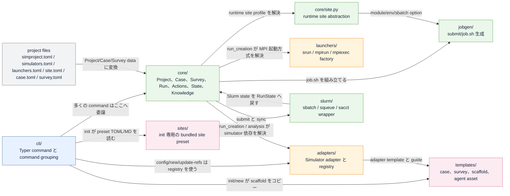

# src/simctl 構成ガイド

> このファイルは `python scripts/generate_architecture_diagrams.py` で生成しています。
> package 境界や依存解決を変えたら script を再実行してください。

simctl の `src/` は、まず次の 3 つを分けて考えると読みやすくなります。

- `cli/` は人間や agent が直接叩く Typer ベースの入り口です。
- `core/` は domain model だけでなく、project 設定から adapter / launcher / site / Slurm をつなぐ orchestration module も持っています。
- `adapters/`、`launchers/`、`core/site.py` はそれぞれ別の可変軸です。
  simulator 固有差分、MPI 起動方式、cluster/site 固有差分を分離しています。

いまの実装で特に混乱しやすいのは `site` まわりです。

- `src/simctl/sites/` は project の runtime site 設定そのものではありません。
- ここは `simctl init` が一度だけ読む bundled preset 集です。
- 実行時に使われる site の本体は project root の `site.toml` で、解決ロジックは `src/simctl/core/site.py` にあります。

## top-level directory 一覧

| Directory | 役割 | 現在の規模 |
|---|---|---|
| `cli/` | Typer ベースの CLI エントリポイントと対話 UX | 22 個の Python module |
| `core/` | ドメインモデル、実行オーケストレーション、manifest、state、knowledge | 21 個の Python module |
| `adapters/` | シミュレータ固有処理と adapter registry | 9 個の Python module |
| `launchers/` | MPI 起動ラッパーと launcher factory | 5 個の Python module |
| `jobgen/` | job、launcher、site から job.sh を組み立てる層 | 2 個の Python module |
| `slurm/` | sbatch / squeue / sacct の薄いラッパー | 3 個の Python module |
| `sites/` | simctl init だけが読む bundled site preset | 1 個の preset TOML、1 個の companion doc |
| `templates/` | project / case / survey にコピーされる静的テンプレート | 37 個の template asset |

## 全体構造



## runs create / sweep の依存解決

```mermaid
flowchart TB
    CREATECLI["simctl runs create / runs sweep<br/>src/simctl/cli/create.py"]
    ACTIONS["core/actions.py<br/>execute_action('create_run' / 'create_survey')"]
    PROJECT["load_project()<br/>simproject.toml + simulators.toml + launchers.toml"]
    CASE["load_case() / load_survey()<br/>case.toml と optional survey.toml"]
    ADREG["load_adapter_for_simulator()<br/>adapter 名 = sim_cfg['adapter'] or simulator 名"]
    ADIMPORT["AdapterRegistry.load_from_config()<br/>import simctl.adapters.contrib.<adapter><br/>or simctl.adapters.<adapter>"]
    ADAPTER["adapter instance<br/>render_inputs / resolve_runtime / build_program_command / collect_provenance"]
    LAUNCHER["load_launcher_for_name()<br/>load_launchers() -> Launcher.from_config(type)"]
    SITE["load_site_profile()<br/>site.toml -> legacy launchers.toml -> STANDARD_SITE"]
    JOBGEN["generate_job_script()<br/>launcher exec line + site modules/env/directive"]
    RUNARTIFACT["run directory<br/>input/ + submit/job.sh + manifest.toml"]

    CREATECLI -->|Typer command dispatch| ACTIONS
    ACTIONS -->|project config を読む| PROJECT
    ACTIONS -->|case / survey を解決| CASE
    PROJECT -->|project.simulators| ADREG
    CASE -->|case.simulator または survey override| ADREG
    ADREG -->|adapter module を import| ADIMPORT
    ADIMPORT -->|adapter class を instantiate| ADAPTER
    PROJECT -->|project.launchers| LAUNCHER
    CASE -->|case.launcher または survey override| LAUNCHER
    PROJECT -->|project root| SITE
    ADAPTER -->|build_program_command()| JOBGEN
    LAUNCHER -->|build_exec_line()| JOBGEN
    SITE -->|site module/env/sbatch| JOBGEN
    JOBGEN -->|submit/job.sh を書く| RUNARTIFACT
    ADAPTER -->|input と provenance を書く| RUNARTIFACT
    CASE -->|job params と display name| RUNARTIFACT

    classDef artifact fill:#f2f3f5,stroke:#7f7f7f,stroke-width:1px,color:#132238;
    classDef config fill:#fcebf1,stroke:#d37295,stroke-width:1px,color:#132238;
    classDef domain fill:#eaf7ea,stroke:#59a14f,stroke-width:1px,color:#132238;
    classDef entry fill:#e8f1ff,stroke:#4e79a7,stroke-width:1px,color:#132238;
    classDef plugin fill:#fff4dd,stroke:#f28e2b,stroke-width:1px,color:#132238;
    class CREATECLI entry
    class ACTIONS domain
    class PROJECT config
    class CASE config
    class ADREG plugin
    class ADIMPORT plugin
    class ADAPTER plugin
    class LAUNCHER plugin
    class SITE domain
    class JOBGEN domain
    class RUNARTIFACT artifact
```

## site の init 時 preset と runtime 解決

```mermaid
flowchart TB
    BUNDLED["src/simctl/sites/*.toml + *.md<br/>例: camphor.toml / camphor.md"]
    INITCLI["simctl init<br/>src/simctl/cli/init.py"]
    PROJSITE["project site.toml<br/>runtime site の source of truth"]
    PROJLAUNCHERS["project launchers.toml<br/>init 時に launcher default をコピー"]
    CASENEW["simctl case new<br/>resource_style を見て job field 形状を変える"]
    RUNTIME["core/site.load_site_profile()"]
    STANDARD["STANDARD_SITE<br/>site customisation なし"]
    JOBGEN["jobgen.generate_job_script()"]
    JOBSH["submit/job.sh<br/>module load / export / #SBATCH / stdout-stderr format"]

    BUNDLED -->|init 時に preset を選ぶ| INITCLI
    INITCLI -->|[site] section を書く| PROJSITE
    INITCLI -->|[launcher] default をコピー| PROJLAUNCHERS
    PROJSITE -->|第1優先| RUNTIME
    PROJLAUNCHERS -->|legacy fallback| RUNTIME
    STANDARD -->|最終 fallback| RUNTIME
    PROJSITE -->|resource_style が case template に効く| CASENEW
    RUNTIME -->|SiteProfile| JOBGEN
    JOBGEN -->|最終 script を生成| JOBSH

    classDef artifact fill:#f2f3f5,stroke:#7f7f7f,stroke-width:1px,color:#132238;
    classDef config fill:#fcebf1,stroke:#d37295,stroke-width:1px,color:#132238;
    classDef domain fill:#eaf7ea,stroke:#59a14f,stroke-width:1px,color:#132238;
    classDef entry fill:#e8f1ff,stroke:#4e79a7,stroke-width:1px,color:#132238;
    class BUNDLED config
    class INITCLI entry
    class PROJSITE config
    class PROJLAUNCHERS config
    class CASENEW entry
    class RUNTIME domain
    class STANDARD artifact
    class JOBGEN domain
    class JOBSH artifact
```

## adapter / launcher 解決の要点

たとえば `case.toml` に `simulator = "emses"`、`launcher = "camphor"` と書かれているとき、
実行時の解決は次の順で進みます。

- `core/run_creation.py` が project、case、必要なら survey override を読みます。
- simulator entry は `project.simulators` から引かれます。
- `load_adapter_for_simulator()` がその entry から adapter 名を取り出します。
- `AdapterRegistry.load_from_config()` は `simctl.adapters.contrib.<adapter>` を先に、次に `simctl.adapters.<adapter>` を import しようとします。
- import に成功すると registry から adapter class を取り出し、instance 化します。
- launcher 側はより単純で、`load_launchers()` が `launchers.toml` をたどり、`Launcher.from_config()` が `type` / `kind` に応じて `SrunLauncher`、`MpirunLauncher`、`MpiexecLauncher` を選びます。
- `core/site.load_site_profile()` は launcher と独立に site を解決し、最後に `jobgen.generate_job_script()` が launcher 出力と site 固有の module、environment variable、stdout/stderr format、追加 `#SBATCH` directive を合成します。

つまり責務分担は次のように切られています。

- Adapter は `何を実行するか` と `入出力がどう見えるか` を決めます。
- Launcher は `その program command を MPI でどう包むか` を決めます。
- Site は `その cluster が job script に何を要求するか` を決めます。

## 次に読むと理解しやすい file

- `src/simctl/cli/main.py`: 最上位のコマンド登録。
- `src/simctl/core/actions.py`: CLI と agent が使う薄い action facade。
- `src/simctl/core/run_creation.py`: case -> adapter -> launcher -> site -> job.sh をつなぐ実行時の中心。
- `src/simctl/core/site.py`: runtime の site 解決。site.toml、legacy launcher fallback、STANDARD_SITE を扱う。
- `src/simctl/adapters/registry.py`: simulator adapter の registry と import-by-name 解決。
- `src/simctl/launchers/base.py`: Launcher.from_config() による launcher factory と profile 読み込み。
- `src/simctl/jobgen/generator.py`: site 固有の module / directive を含む最終的な Slurm job script 生成。
- `src/simctl/slurm/query.py`: Slurm state の問い合わせと simctl RunState への写像。
- `src/simctl/cli/init.py`: init 時に src/simctl/sites/*.toml を読み、project 側の site.toml を書く。

