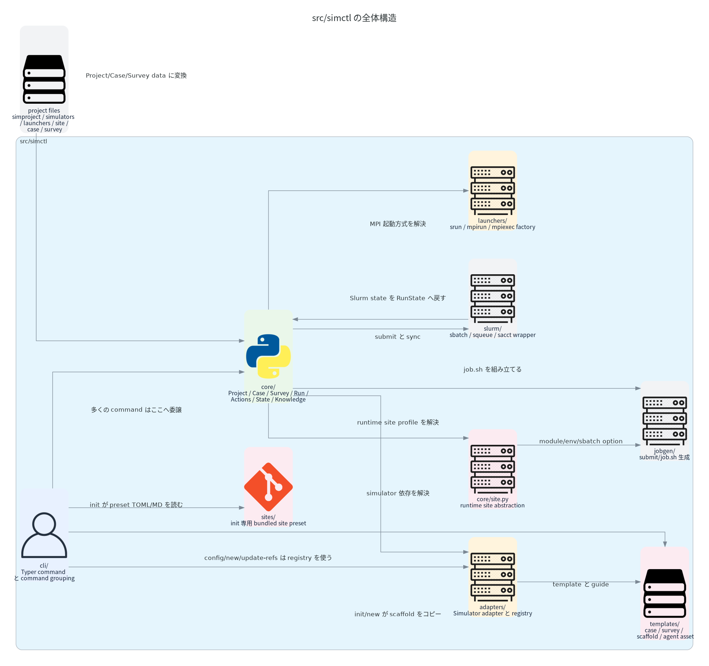
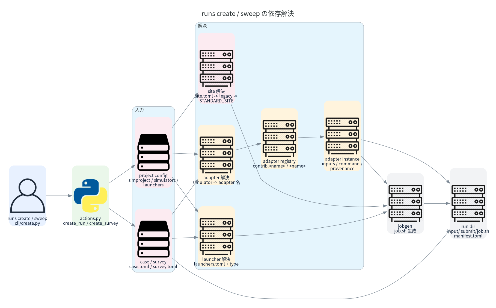
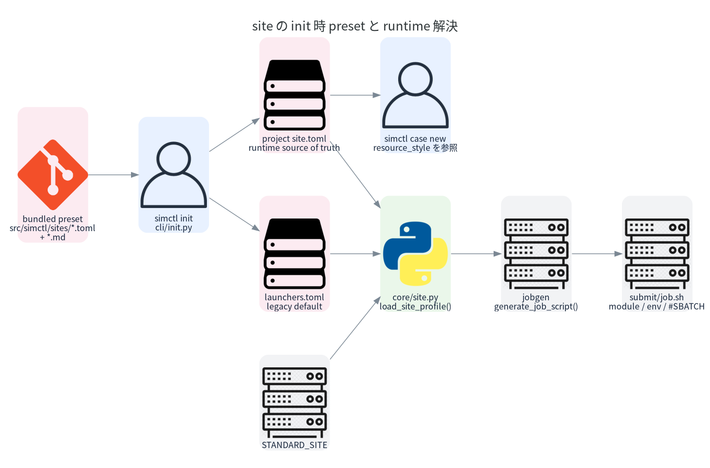

# src/runops 構成ガイド

> このファイルは `python scripts/generate_architecture_diagrams.py` で生成しています。
> 標準の再生成手順は `python scripts/render_diagrams_in_docker.py` です。

runops の `src/` は、まず次の 3 つを分けて考えると読みやすくなります。

- `cli/` は人間や agent が直接叩く Typer ベースの入り口です。
- `core/` は domain model だけでなく、project 設定から adapter / launcher / site / Slurm をつなぐ orchestration module も持っています。
- `adapters/`、`launchers/`、`core/site.py` はそれぞれ別の可変軸です。
  simulator 固有差分、MPI 起動方式、cluster/site 固有差分を分離しています。

いまの実装で特に混乱しやすいのは `site` まわりです。

- `src/runops/sites/` は project の runtime site 設定そのものではありません。
- ここは `runops init` が一度だけ読む bundled preset 集です。
- 実行時に使われる site の本体は project root の `site.toml` で、解決ロジックは `src/runops/core/site.py` にあります。

## top-level directory 一覧

| Directory | 役割 | 現在の規模 |
|---|---|---|
| `cli/` | Typer ベースの CLI エントリポイントと対話 UX | 24 個の Python module |
| `core/` | ドメインモデル、実行オーケストレーション、manifest、state、knowledge | 21 個の Python module |
| `adapters/` | シミュレータ固有処理と adapter registry | 9 個の Python module |
| `launchers/` | MPI 起動ラッパーと launcher factory | 5 個の Python module |
| `jobgen/` | job、launcher、site から job.sh を組み立てる層 | 2 個の Python module |
| `slurm/` | sbatch / squeue / sacct の薄いラッパー | 3 個の Python module |
| `sites/` | runops init だけが読む bundled site preset | 1 個の preset TOML、1 個の companion doc |
| `templates/` | project / case / survey にコピーされる静的テンプレート | 37 個の template asset |

## 全体構造

## runs create / sweep の依存解決

## site の init 時 preset と runtime 解決

## adapter / launcher 解決の要点

たとえば `case.toml` に `simulator = "emses"`、`launcher = "camphor"` と書かれているとき、
実行時の解決は次の順で進みます。

- `core/run_creation.py` が project、case、必要なら survey override を読みます。
- simulator entry は `project.simulators` から引かれます。
- `load_adapter_for_simulator()` がその entry から adapter 名を取り出します。
- `AdapterRegistry.load_from_config()` は `runops.adapters.contrib.<adapter>` を先に、次に `runops.adapters.<adapter>` を import しようとします。
- import に成功すると registry から adapter class を取り出し、instance 化します。
- launcher 側はより単純で、`load_launchers()` が `launchers.toml` をたどり、`Launcher.from_config()` が `type` / `kind` に応じて `SrunLauncher`、`MpirunLauncher`、`MpiexecLauncher` を選びます。
- `core/site.load_site_profile()` は launcher と独立に site を解決し、最後に `jobgen.generate_job_script()` が launcher 出力と site 固有の module、environment variable、stdout/stderr format、追加 `#SBATCH` directive を合成します。

つまり責務分担は次のように切られています。

- Adapter は `何を実行するか` と `入出力がどう見えるか` を決めます。
- Launcher は `その program command を MPI でどう包むか` を決めます。
- Site は `その cluster が job script に何を要求するか` を決めます。

## 次に読むと理解しやすい file

- `src/runops/cli/main.py`: 最上位のコマンド登録。
- `src/runops/core/actions.py`: CLI と agent が使う薄い action facade。
- `src/runops/core/run_creation.py`: case -> adapter -> launcher -> site -> job.sh をつなぐ実行時の中心。
- `src/runops/core/site.py`: runtime の site 解決。site.toml、legacy launcher fallback、STANDARD_SITE を扱う。
- `src/runops/adapters/registry.py`: simulator adapter の registry と import-by-name 解決。
- `src/runops/launchers/base.py`: Launcher.from_config() による launcher factory と profile 読み込み。
- `src/runops/jobgen/generator.py`: site 固有の module / directive を含む最終的な Slurm job script 生成。
- `src/runops/slurm/query.py`: Slurm state の問い合わせと runops RunState への写像。
- `src/runops/cli/init.py`: init 時に src/runops/sites/*.toml を読み、project 側の site.toml を書く。

